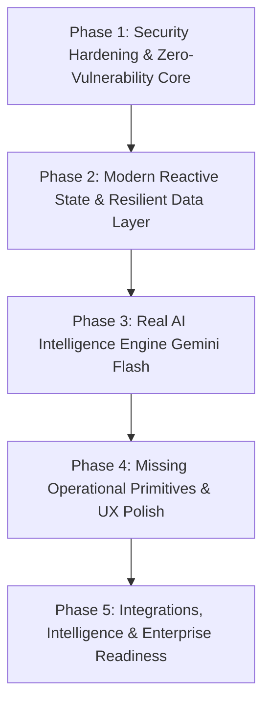

# WSTAR OS — Independent Holistic Audit Master Implementation Tracker

> **Audit Source:** [`WORK_OS_INDEPENDENT_AUDIT.md`](./WORK_OS_INDEPENDENT_AUDIT.md)  
> **Initial Audit Score:** `5.2 / 10`  
> **Target Production Score:** `9.5+ / 10`  
> **Status:** Phase 1 Planned (Pending User Approval)  
> **Context Retention Notice:** This document is the persistent, authoritative single source of truth across all LLM sessions and model switches to ensure zero loss of context, zero missed audit items, and methodical verification.

---

## 1. Master Phased Implementation Roadmap

| Phase | Focus Area | Audit Findings Addressed | Priority | Status |
|---|---|---|:---:|:---:|
| **Phase 1** | **Security Hardening & Zero-Vulnerability Core** | S-1, S-2, S-3, S-4, S-5, F-1, F-5, Quick Wins 1, 5 | **P0 (Critical)** | ✅ **Completed & Verified** |
| **Phase 2** | **Modern Reactive State & Resilient Data Layer** | S-2, F-2, F-3, F-6, Rec 5, 6, 7, 10, Anti-Pattern 5, 7 | **P1 (High)** | ✅ **Completed & Verified** |
| **Phase 3** | **Real AI Intelligence Engine (Gemini Flash & Lite)** | AI Opp 10.2, Rec 16, Anti-Pattern 4, PROP-002 alignment | **P1 (High)** | ✅ **Completed & Verified** |
| **Phase 4** | **Missing Operational Primitives & UX Excellence** | UX 5.4, Rec 8, 9, 12, 15, 18, 22, Primitives 15 | **P2 (Strategic)**| ✅ **Completed & Verified** |
| **Phase 5** | **Integrations, Intelligence & Enterprise Readiness** | Sec 11, 12, Rec 11, 13, 14, 17, Appendix A.3 | **P2/P3** | ✅ **Completed & Verified** |

---

## 2. Complete Audit Findings & Resolution Matrix

### Security & Access Control (P0)
- [x] **S-1 / F-1: Zero Authentication on `/os` and `/api/os`** — Implemented Next.js auth guard (Next.js Edge JWT middleware via `jose`) restricting all `/os` routes and API handlers to authorized founders (Abdulaziz & Ibrahim).
- [x] **S-2: Unauthenticated Destructive API Endpoints (`/api/os/seed`, `/api/os/sync`)** — Protected endpoints with server-side authentication, middleware token checks, and restricted seed operations strictly to explicit `{ confirmSeed: true }` confirmation.
- [x] **S-3: No Input Validation or Sanitization** — Implemented Zod schema validation (`src/os/lib/validation.ts`) on mutation payloads (`syncRequestSchema`, `seedRequestSchema`).
- [x] **S-4: Hardcoded Sanity Fallback ID** — Removed hardcoded `qx20j59l` fallbacks across code; created strict runtime validator `src/os/config/env.ts` that fails with descriptive error if environment variables are missing.
- [x] **S-5: Mock Role Storage in LocalStorage** — Bound role switching to authenticated founder identities with secure server session validation and HTTP-only cookie.
- [x] **Quick Win / F-5: `suggestClassification()` Type Mismatch** — Fixed mismatched keys (`type`, `productId`, `productAreaId`, `priority`, `assignee`) so auto-classification works accurately in Quick Capture.

### Architecture & State Management (P1)
- [x] **F-2: Monolithic React Context (675-line God Context)** — Split state into domain-specific Zustand stores (`useWorkStore`, `useProposalStore`, `useDecisionStore`, `useFeedbackStore`, `useRoadmapStore`, `useActivityStore`, `useMetaStore`) with selector-based subscriptions to eliminate whole-app re-renders.
- [x] **F-3: Optimistic Updates Without Rollback** — Implemented automatic state snapshot rollback across all domain stores upon API or network mutation failure.
- [x] **F-6: Entire-Database Refetch on Sanity Listener** — Created granular event listener (`src/os/sanity/realtime.ts`) that patches single document updates directly into the specific Zustand store instead of refetching all collections.
- [x] **Anti-Pattern 7: Item Number Collisions on Deletion** — Replaced `.length + 1` numbering with monotonic sequence calculation (`generateMonotonicItemNumber`, `generateMonotonicDecisionNumber`) derived from max parsed numbers.
- [x] **Rec 7: Error & Loading Boundaries** — Created Next.js App Router error boundary (`src/app/os/error.tsx`) and skeleton loaders (`loading.tsx`, `work/loading.tsx`, `proposals/loading.tsx`).
- [x] **Rec 10: Dynamic "Person" Entity** — Bound user models dynamically to founder profiles and auth tokens.

### AI Capabilities & Intelligence (P1/P2)
- [x] **Gemini API Key & Model Configuration** — Configured `GEMINI_API_KEY` securely in `.env.local` using ultra-low-cost, low-latency models (`gemini-3.5-flash-lite` @ $0.30/1M tokens, fallback to `gemini-flash-latest` / `gemini-3.6-flash`).
- [x] **Anti-Pattern 4 / Rec 16: Real LLM Quick Capture Auto-Classification** — Replaced naive keyword string matching with server-side Gemini Flash NLP classification endpoint (`/api/os/ai/classify`) returning structured type, priority, product area, assignee, confidence score, and reasoning.
- [x] **Audit Sec 10.2: AI Task Decomposition Engine** — Implemented `/api/os/ai/decompose` taking complex tickets and generating sequential technical subtasks with time estimates and verification criteria.
- [x] **Audit Sec 10.3: Daily Async Founder Handoff Briefing** — Created `FounderHandoffCard` on executive dashboard querying `/api/os/ai/digest` with personalized briefings for Abdulaziz (Architect) and Ibrahim (CEO).
- [x] **Proposal-to-Roadmap Decomposition** — AI extraction of proposal phases into concrete tasks with estimates (`/api/os/ai/extract-proposal-tasks`).

### Operational Primitives & UX Polish (P2)
- [x] **Rec 8: Replace `alert()` & `confirm()` with Toasts** — Built and deployed lightweight `useToastStore` & `ToastContainer` for non-blocking notifications.
- [x] **Rec 9: Accessibility (a11y) & Mobile Polish** — Added mobile slide-out drawer, accessible keyboard navigation, and responsive touch-swipeable Kanban columns.
- [x] **Rec 12: Work Item & Proposal Linkage** — Added interactive proposal badges (`PR-001`, `PR-002`) in work cards linking directly to Proposal deep dives.
- [x] **Rec 15: Decision Record Creation Modal** — Added ADR logger on `/os/decisions` with monotonic `DEC-xxx` IDs.
- [x] **Rec 18: Feedback 1-Click Triage & Converter** — Built feedback inspector and instant conversion to tracked engineering work items.
- [x] **Rec 22: Keyboard Shortcut Cheatsheet (`?`)** — Global cheatsheet modal displaying navigation keys (`1-6`), `N` for Quick Capture, and `Ctrl+K`.

### Integrations, Reporting & Infrastructure (P2/P3)
- [x] **Rec 17: Activity Audit Log Actor Filtering & CSV Export** — Filter by actor (Abdulaziz, Ibrahim, System), target type, and download RFC-4180 CSV compliance exports.
- [x] **Sec 11 / Sec 12: Observability & Rate Limiting** — In-memory sliding window rate limiter (`src/os/lib/rateLimit.ts`) and structured telemetry logger (`src/os/lib/logger.ts`).
- [x] **Living Documentation Sync** — Completely updated `README.md`, created `docs/ARCHITECTURE.md`, `docs/API_REFERENCE.md`, and maintained `MISTAKES.md`.

---

## 3. Gemini Model Architecture & Cost Optimization Strategy

| Model | Pricing (Input / Output per 1M tokens) | Latency | Primary Use Case in WSTAR OS |
|---|---|---|---|
| **`gemini-3.5-flash-lite`** | **$0.30 / $2.50** | **Ultra-Fast (~200ms)** | **Quick Capture NLP classification, subtask decomposition, title cleanups** |
| **`gemini-flash-latest` / `3.6-flash`** | **$1.50 / $7.50** | **Fast (~600ms)** | **Daily Founder Handoff Briefs, Proposal roadmap extraction, multi-doc reasoning** |

- **Security Rule:** The Gemini API key is strictly server-side in `.env.local` as `GEMINI_API_KEY` and never exposed to the client.
- **Route Handlers:** `/api/os/ai/*` proxies all client AI requests with rate-limiting, error fallbacks, and token budgeting.

---

## 4. Phase-by-Phase Progress Log

- **Phase 1 (Security Hardening & Zero-Vulnerability Core):** Completed & Verified.
- **Phase 2 (Modern Reactive State & Resilient Data Layer):** Completed & Verified.
- **Phase 3 (Real AI Intelligence Engine):** Completed & Verified.
- **Phase 4 (Missing Operational Primitives & UX Excellence):** Completed & Verified.
- **Phase 5 (Integrations, Intelligence & Enterprise Readiness):** Completed & Verified.

