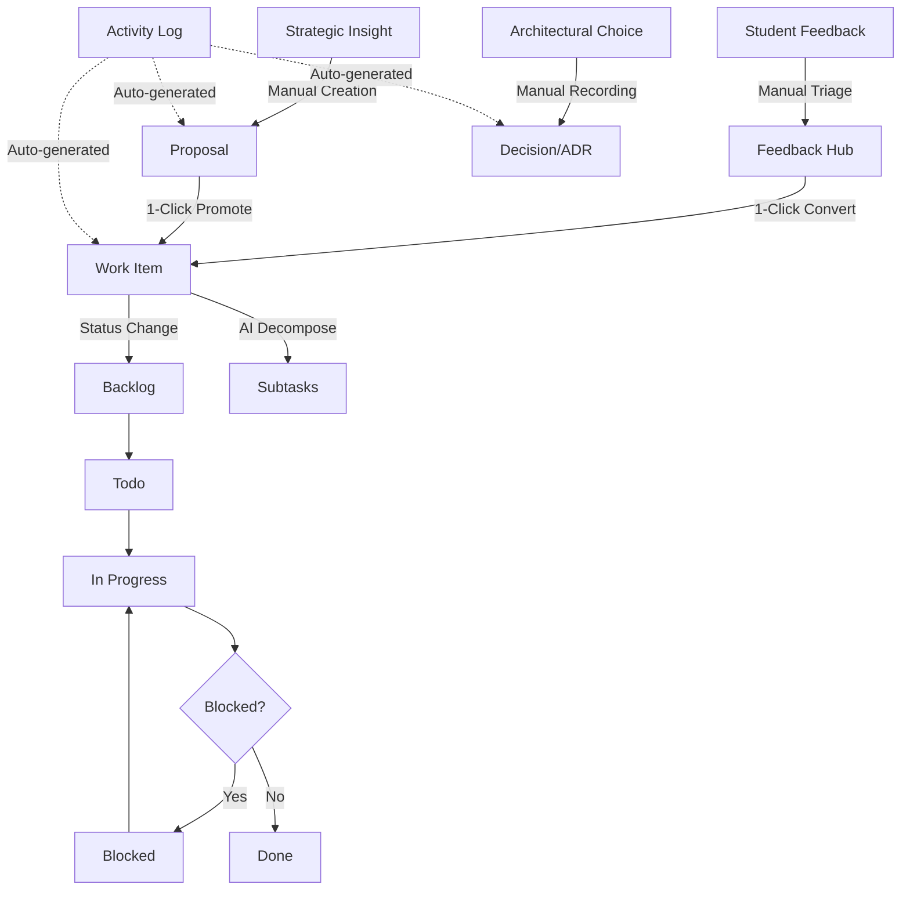
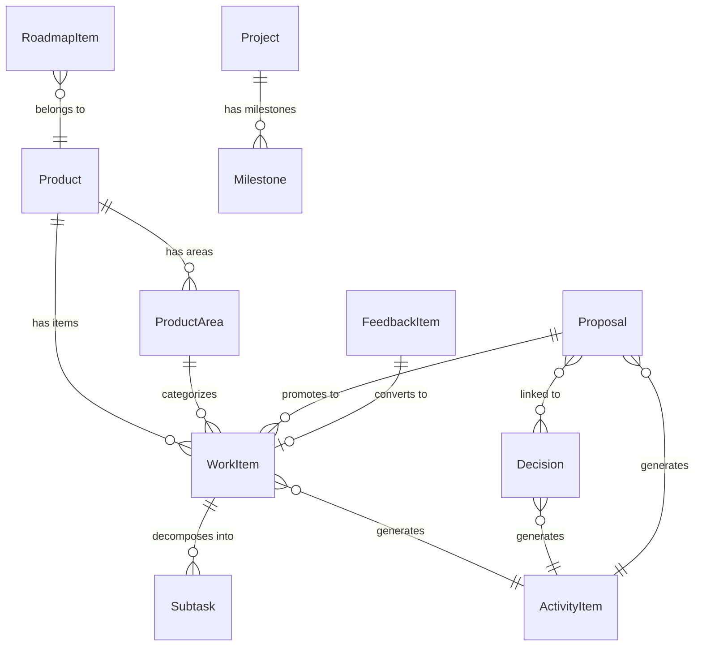

# WSTAR Company Operating System — Independent Holistic Audit

> **Audit Date:** 2026-08-19
> **Auditor:** Independent AI Systems Architect & Product Evaluator
> **Repository:** `KingAbdulAx/wstar-website`
> **Commit:** `5c1424f` (latest as of audit)

---

## Table of Contents

1. [Executive Summary](#1-executive-summary)
2. [Product Understanding](#2-product-understanding)
3. [Current Operating Model](#3-current-operating-model)
4. [Product Assessment](#4-product-assessment)
5. [UX Assessment](#5-ux-assessment)
6. [Workflow & Operations Assessment](#6-workflow--operations-assessment)
7. [Architecture Assessment](#7-architecture-assessment)
8. [Security Assessment](#8-security-assessment)
9. [Data & Information Architecture](#9-data--information-architecture)
10. [Automation & AI Opportunities](#10-automation--ai-opportunities)
11. [Reporting & Intelligence](#11-reporting--intelligence)
12. [Integrations & Ecosystem](#12-integrations--ecosystem)
13. [Competitive/Category Perspective](#13-competitivecategory-perspective)
14. [Product Potential](#14-product-potential)
15. [Missing Primitives](#15-missing-primitives)
16. [Anti-Patterns](#16-anti-patterns)
17. [Findings & Evidence](#17-findings--evidence)
18. [Scorecard](#18-scorecard)
19. [Prioritized Recommendations](#19-prioritized-recommendations)
20. [7/30/90-Day Roadmap](#20-73090-day-roadmap)
21. [6–12 Month Strategic Direction](#21-612-month-strategic-direction)
22. [Final Verdict](#22-final-verdict)
23. [Appendix: Technical Findings](#23-appendix-technical-findings)

---

## 1. Executive Summary

WSTAR OS is a **bespoke company operating system** built by a two-person founding team (Abdulaziz — Lead Engineer, Ibrahim — CEO) to manage their startup's engineering execution, strategic planning, legal governance, and customer feedback across three products (Ace Acad, PlantIQ, WSTAR Core).

### What It Gets Right

The product demonstrates **genuinely thoughtful product design** that exceeds what most early-stage startups build for internal tooling:

- **Dual-Perspective Architecture** — The system fundamentally understands that a CTO and CEO need asymmetric views of the same data. This is a genuinely differentiated concept.
- **End-to-End Traceability** — The pipeline from `Customer Feedback → Strategic Proposal → Decision Record → Work Item` mirrors best-in-class 2026 Work OS philosophy.
- **Institutional Memory** — The Decision Ledger (ADR system) and Proposals Hub treat organizational knowledge as a first-class citizen, not an afterthought.
- **Hybrid Resilient Sync** — The optimistic-local + Sanity Cloud architecture delivers real-time cross-device collaboration with offline resilience, achieving Linear-grade responsiveness without SaaS subscription costs.
- **Design Quality** — Clean, restrained editorial aesthetics. No generic AI design tells.

### What Threatens It

> [!CAUTION]
> **Three Critical Issues Must Be Addressed Immediately:**

1. **Zero Authentication** — The entire `/os` route and all API endpoints are publicly accessible. Any visitor can read company strategy, mutate production data, or overwrite the Sanity database by hitting `/api/os/seed`.
2. **Monolithic State Management** — A single React Context holding all data causes whole-app re-renders on every mutation. This will degrade severely as data grows beyond the current ~60 seed items.
3. **The Product Is a Dashboard, Not an Operating System** — Despite the name, the current implementation is primarily *a sophisticated read-and-display layer over static seed data*. It records work but doesn't truly help the organization *operate*.

### Bottom Line

WSTAR OS is a **solid V1 prototype** with unusually strong product thinking for its stage. It belongs to the rare category of internal tools that could potentially evolve into something genuinely valuable. However, the security posture makes it undeployable, the architecture won't scale past ~200 items, and the system is closer to "software that records work" than "software that helps an organization operate."

**Overall Score: 5.2 / 10** — Strong conceptual foundation, significant implementation gaps.

---

## 2. Product Understanding

### 2.1 What the Application Is

A dual-system Next.js 16 application:

| System | Path | Purpose |
|--------|------|---------|
| Marketing Shell | `/` | Public corporate website, product showcases (Ace Acad, PlantIQ), investor relations, legal policies |
| Company OS | `/os` | Internal operational dashboard for the two co-founders |

### 2.2 Who It Is For

Exclusively the two WSTAR co-founders:

- **Abdulaziz Abdulwahab** — Lead Technical Architect (Flutter/mobile engineering, backend systems)
- **Ibrahim Abdulwahab** — CEO (business strategy, legal compliance, campus operations, fundraising)

### 2.3 The Products Being Managed

| Product | Status | Description |
|---------|--------|-------------|
| **Ace Acad** | Beta | Smart academic companion for Nigerian university students (100L ABU Zaria cohort) |
| **PlantIQ** | Planning | AI-driven crop disease detection for African smallholder farmers |
| **WSTAR Core** | Live | Corporate governance, marketing web properties, investor relations |

### 2.4 Core Features

| Feature | Path | Status |
|---------|------|--------|
| Dual-Perspective Dashboard | `/os` | ✅ Functional |
| Work Stream & Bug Tracker | `/os/work` | ✅ Functional (List + Kanban views) |
| Strategic Proposals Hub | `/os/proposals` | ✅ Functional (3 detailed proposals) |
| Decision Ledger (ADRs) | `/os/decisions` | ✅ Functional (6 ADRs) |
| Customer Feedback Triage | `/os/feedback` | ✅ Functional |
| Ace Acad Command Center | `/os/ace-acad` | ✅ Functional |
| Roadmap Planner | `/os/roadmap` | ✅ Functional (Now/Next/Later) |
| Activity Stream | `/os/activity` | ✅ Functional |
| Command Palette | `Ctrl+K` | ✅ Functional |
| Quick Capture | `+ Quick Capture` | ✅ Functional |
| AI Auto-Classification | Quick Capture | ⚠️ Keyword-matching only |
| Sanity Cloud Sync | Real-time | ✅ Functional (with fallback) |

### 2.5 Technology Stack

| Layer | Technology |
|-------|-----------|
| Framework | Next.js 16.1.6 (App Router, Turbopack) |
| UI | React 19.2.3 + Tailwind CSS v4 |
| Icons | Lucide React |
| Backend/CMS | Sanity CMS (Cloud) + GROQ queries |
| State | React Context + localStorage |
| Deployment | Vercel |
| Auth | ❌ None |

---

## 3. Current Operating Model

### 3.A Fundamental Unit of Work

The system treats the **WorkItem** as its fundamental unit. A WorkItem can be a task, bug, feature, tech_debt item, improvement, or research item. Items flow through a 5-stage Kanban pipeline:

```
Backlog → Todo → In Progress → Blocked → Done
```

However, the *actual* fundamental unit the organization manages is the **Decision**. The most valuable part of WSTAR OS is not its task tracker (which is generic) — it's the end-to-end chain:

```
Customer Feedback → Strategic Proposal → Architectural Decision → Work Item → Execution
```

This chain represents organizational intelligence, not just task management.

### 3.B Work Lifecycle (Actual)



### 3.C Information Capture Analysis

| Captured | Not Captured | Could Be Inferred |
|----------|-------------|-------------------|
| Task title, description, status | Time spent on tasks | Velocity trends |
| Priority (P0-P3) | Actual deadlines vs. completion | Deadline accuracy |
| Assignee (2 people) | Comments/discussion | Collaboration patterns |
| Code references | Git commits/PRs | Actual progress |
| Subtask completion | Dependencies between items | Blocking chains |
| Decision rationale | Meeting notes | Decision frequency |
| Proposal cost estimates | Actual spend | Budget variance |
| Feedback intake | User sentiment trends | Satisfaction trajectory |

### 3.D Decision Support (Current vs. Needed)

| Question | Can Answer? | How? |
|----------|-------------|------|
| What should I work on? | ⚠️ Partial | Dashboard shows top 3 by priority, but no true prioritization intelligence |
| What is blocked? | ✅ Yes | Filter by "Blocked" status |
| What requires my attention? | ⚠️ Partial | CEO view shows pending items, but no urgency escalation |
| Who is overloaded? | ❌ No | Only 2 assignees, no workload visualization |
| What is falling behind? | ❌ No | No deadline tracking with alerts |
| What decisions are pending? | ⚠️ Partial | Decision ledger exists but no "pending" status is used |
| What risks are emerging? | ❌ No | No risk detection |
| What has been completed? | ✅ Yes | Filter by "Done" status |
| What keeps going wrong? | ❌ No | No pattern analysis |
| What should happen next? | ❌ No | No intelligent next-action suggestions |

---

## 4. Product Assessment

### Is the problem clearly defined?

**Yes, partially.** The problem — "two founders need asymmetric views of their company's operations without paying for 8+ SaaS tools" — is well-defined and genuinely meaningful. The solution is coherent within this scope.

### Is the feature set coherent?

**Yes.** Every feature serves the operating model. There is no feature bloat. Each module (Work, Proposals, Decisions, Feedback, Roadmap, Activity) has a clear purpose and they interconnect logically.

### What's Missing?

The critical gap is the difference between:

| Category | Current | Needed |
|----------|---------|--------|
| **Input** | Manual data entry | Intelligent capture from multiple sources |
| **Processing** | Static display | Dynamic analysis and inference |
| **Output** | Dashboards | Actionable recommendations |
| **Time** | Snapshot view | Trend analysis over time |
| **Communication** | None | Async handoff between founders |
| **Accountability** | Status badges | Deadline enforcement, follow-up |

### Software That Records Work vs. Software That Helps Operate

**Current category: Records work** (with some organizational intelligence through Proposals/ADRs).

The system excels at *capturing* what the founders decide and plan. It fails at *proactively helping them operate*. It doesn't tell them what to do next, what's falling behind, what needs discussion, or what patterns are emerging from their data.

---

## 5. UX Assessment

### 5.1 Discoverability & Learnability

**Score: 7/10** — The sidebar navigation is clear, the Command Palette (`Ctrl+K`) provides power-user discoverability, and the dual-perspective toggle is immediately visible in the header. However, the system provides no onboarding, tooltips, or progressive disclosure for first-time users.

### 5.2 Cognitive Load

**Score: 6/10** — The dashboard (especially Abdulaziz's engineer view) presents information at high density without overwhelming. However:

- The CEO dashboard hardcodes descriptive text ("Bridge Ambassador playbook, monetization, & NDPC registration") rather than deriving it from data, meaning it can become stale.
- There is no distinction between urgent, important, and informational items beyond priority badges.
- Maturity percentages are static seed data, not computed from actual task completion.

### 5.3 Information Hierarchy

The visual hierarchy is well-executed through consistent patterns:
- **Monospace** for item numbers (TASK-001, BUG-001)
- **Bold + color** for priority badges
- **Status badges** with semantic colors
- **Section headers** with uppercase tracking and Lucide icons

**Weakness:** No temporal urgency indicators (overdue dates, stale items, aging blocked work).

### 5.4 Accessibility Findings

| Issue | Severity | Location |
|-------|----------|----------|
| Navbar hamburger uses `<div>` instead of `<button>` | High | [`Navbar.tsx`](file:///c:/Users/USER/Documents/GitHub/wstar-website/src/components/Navbar.tsx) |
| Products dropdown trigger is not keyboard-accessible | High | [`Navbar.tsx`](file:///c:/Users/USER/Documents/GitHub/wstar-website/src/components/Navbar.tsx) |
| Mobile sidebar drawer lacks focus trapping | High | [`layout.tsx`](file:///c:/Users/USER/Documents/GitHub/wstar-website/src/app/os/layout.tsx) |
| Command Palette lacks focus trapping | Medium | [`CommandPalette.tsx`](file:///c:/Users/USER/Documents/GitHub/wstar-website/src/os/components/CommandPalette.tsx) |
| Contact form uses `alert()` for success feedback | Medium | [`ContactForm.tsx`](file:///c:/Users/USER/Documents/GitHub/wstar-website/src/components/ContactForm.tsx) |
| Feedback conversion uses `alert()` | Medium | [`feedback/page.tsx`](file:///c:/Users/USER/Documents/GitHub/wstar-website/src/app/os/feedback/page.tsx) |
| No `loading.tsx` or `error.tsx` boundaries | Medium | Entire `/app` directory |

### 5.5 CSS Architecture Inconsistency

> [!WARNING]
> The codebase uses **two incompatible styling paradigms**: CSS Modules for the marketing shell and Tailwind CSS utilities for the OS shell. This creates:
> - Impossible shared design system
> - Increased bundle size
> - Visual disconnect between marketing and OS sections
> - Maintenance burden for future developers

### 5.6 Responsive Design

**Strong.** The mobile sidebar drawer with backdrop blur, the swipeable Kanban board using `snap-x snap-mandatory`, and the responsive grid breakpoints demonstrate excellent mobile consideration. The `TopHeader.tsx` component gracefully collapses labels on small screens.

---

## 6. Workflow & Operations Assessment

### If the Entire Company Relied on This Tomorrow

| Operational Need | Support Level | Gap |
|-----------------|--------------|-----|
| **Planning** | ⚠️ Partial | Roadmap exists but has no timeline enforcement |
| **Delegation** | ⚠️ Partial | Assignee field exists but only 2 hardcoded people |
| **Assignment** | ⚠️ Partial | No workload balancing |
| **Execution** | ✅ Good | Work stream with status tracking |
| **Collaboration** | ❌ Missing | No comments, mentions, or async communication |
| **Approval** | ❌ Missing | No approval workflows |
| **Review** | ❌ Missing | No peer review capability |
| **Escalation** | ❌ Missing | No escalation triggers |
| **Reporting** | ❌ Missing | No analytics or trend reports |
| **Documentation** | ⚠️ Partial | ADRs exist but no general docs/wiki |
| **Meetings** | ❌ Missing | No meeting notes or agenda support |
| **Decisions** | ✅ Strong | ADR system is well-designed |
| **Follow-ups** | ❌ Missing | No follow-up tracking |
| **Accountability** | ⚠️ Partial | Activity log records actions but no enforcement |
| **Recurring work** | ❌ Missing | No recurring task support |
| **Dependencies** | ❌ Missing | No dependency modeling |
| **Deadlines** | ⚠️ Partial | Due dates exist but no overdue alerts |
| **Prioritization** | ⚠️ Partial | Manual priority only, no intelligent scoring |

### Processes the Software Makes Harder Than Necessary

1. **Async Founder Handoff:** No way for Abdulaziz to leave a note for Ibrahim about what happened while he was away. The activity log exists but is not designed for communication.
2. **Weekly/Sprint Review:** No summary generation, velocity tracking, or "what got done this week" view.
3. **Customer Feedback Loop:** Feedback triage requires manual classification. The "Convert to Work Item" flow uses `alert()` — a jarring UX anti-pattern.

---

## 7. Architecture Assessment

### 7.1 Architecture Quality

**Separation of Concerns:** Well-structured. The dual-shell architecture (Marketing vs. OS) with layout isolation via [`MarketingShell.tsx`](file:///c:/Users/USER/Documents/GitHub/wstar-website/src/components/MarketingShell.tsx) is clean. OS code lives under `src/os/` with clear subdirectories for `context/`, `types/`, `data/`, `sanity/`, `components/`.

**Major Architectural Concerns:**

| Concern | Severity | Detail |
|---------|----------|--------|
| **Monolithic Context** | High | Single [`OSContext.tsx`](file:///c:/Users/USER/Documents/GitHub/wstar-website/src/os/context/OSContext.tsx) (675 lines) holds ALL application state. Every mutation triggers re-renders across every subscribed component. |
| **Entire-DB Fetch Pattern** | High | [`refreshFromSanity()`](file:///c:/Users/USER/Documents/GitHub/wstar-website/src/os/context/OSContext.tsx#L133-L219) fetches ALL collections (workItems, proposals, decisions, feedback, activities, products, areas) whenever a single document changes via the Sanity real-time listener. |
| **No Server Components** | Medium | Every OS page is `'use client'`. The initial data load could leverage RSC/Suspense for better performance and SEO. |
| **Optimistic Updates Without Rollback** | Medium | State updates locally, then fires `dispatchSanityMutation()` in background. If the API call fails, local state diverges from Sanity permanently. |
| **ID Generation** | Medium | IDs are `Date.now()`-based (e.g., `item-${Date.now()}`), which will collide if two items are created in the same millisecond. |
| **Item Number Collisions** | High | `itemNumber` is calculated from `workItems.filter((i) => i.type === type).length + 1`. Deleting items causes future items to reuse numbers. |

### 7.2 Code Quality

**Strengths:**
- TypeScript types are well-defined with proper union types
- Consistent naming conventions
- Clean JSX structure with reasonable component decomposition
- Good use of Tailwind's responsive prefixes

**Weaknesses:**
- No unit tests whatsoever
- No integration tests
- No E2E tests
- `error: any` throughout catch blocks
- `suggestClassification()` in OSContext returns a type that doesn't match the `ClassificationSuggestion` interface (returns `suggestedType` instead of `type`)
- The seed file ([`initialSeed.ts`](file:///c:/Users/USER/Documents/GitHub/wstar-website/src/os/data/initialSeed.ts)) is 1,571 lines — excessively large for a single file

### 7.3 Database/CMS Design

Sanity CMS is used as the backend database with no defined schema file in the repository. The data model exists only in TypeScript interfaces and seed data mapping logic. This means:

- No server-side validation of document structure
- No referential integrity enforcement
- Relationships are stored as loose string references (`productId: 'ace-acad'`) in TypeScript but as Sanity references (`{ _type: 'reference', _ref: 'product-ace-acad' }`) in the seed route — an impedance mismatch
- No indexes beyond Sanity's default

### 7.4 Performance Concerns

| Issue | Impact | Location |
|-------|--------|----------|
| Full-collection fetch on every real-time event | O(N) for every single-document change | [`OSContext.tsx:253-272`](file:///c:/Users/USER/Documents/GitHub/wstar-website/src/os/context/OSContext.tsx#L253-L272) |
| Client-side array filtering on every render | O(N) per filter operation, multiplied by number of filters | [`work/page.tsx:39-54`](file:///c:/Users/USER/Documents/GitHub/wstar-website/src/app/os/work/page.tsx#L39-L54) |
| localStorage serialization of all data on every state change | Blocks main thread | [`OSContext.tsx:275-288`](file:///c:/Users/USER/Documents/GitHub/wstar-website/src/os/context/OSContext.tsx#L275-L288) |
| No pagination on any list view | All items rendered simultaneously | All OS pages |

### 7.5 What Breaks at 10x/100x Scale

| Scale | Breaking Point |
|-------|---------------|
| **10x** (~600 items) | localStorage size limits, sluggish filtering, noticeable re-render jank, Sanity API rate limits from full-fetch pattern |
| **100x** (~6,000 items) | Application becomes unusable. localStorage exceeds 5MB browser limit. React Context triggers cascade re-renders. Sanity real-time listener generates excessive traffic. |

---

## 8. Security Assessment

> [!CAUTION]
> **The security posture of this application is critically insufficient for production use.**

### 8.1 Critical Findings

#### FINDING S-1: Zero Authentication on Internal OS

**Evidence:** All routes under `/os` and `/api/os/*` have no authentication check.
**Impact:** Any person who knows the URL can access the entire company operating system, including strategic proposals, financial projections, customer feedback, and architectural decisions.
**Severity:** 🔴 CRITICAL
**Confidence:** High — verified by code inspection of all route handlers.

#### FINDING S-2: Unauthenticated Destructive API Endpoints

**Evidence:** [`/api/os/seed`](file:///c:/Users/USER/Documents/GitHub/wstar-website/src/app/api/os/seed/route.ts) accepts POST requests without any authentication. If the server has `SANITY_API_WRITE_TOKEN` configured (which it does in production based on `.env.local`), any external caller can overwrite the entire Sanity production dataset.

[`/api/os/sync`](file:///c:/Users/USER/Documents/GitHub/wstar-website/src/app/api/os/sync/route.ts) accepts POST requests with arbitrary `{ action, docType, id, data }` payloads. An attacker can create, modify, or delete any document.

**Impact:** Complete data destruction or manipulation possible by any external actor.
**Severity:** 🔴 CRITICAL
**Confidence:** High — verified by reading route handler code.

#### FINDING S-3: No Input Validation or Sanitization

**Evidence:** The sync route directly passes user-supplied `data` to `writeClient.create()` or `writeClient.patch().set()` without any validation:

```typescript
// src/app/api/os/sync/route.ts:32-33
const created = await writeClient.create({
  _type: docType,
  ...data,  // Raw user input spread directly
})
```

**Impact:** Potential Sanity document injection, data corruption, or storage of malicious payloads.
**Severity:** 🔴 CRITICAL
**Confidence:** High

#### FINDING S-4: Hardcoded Sanity Project ID

**Evidence:** The project ID `qx20j59l` is hardcoded as a fallback in:
- [`client.ts`](file:///c:/Users/USER/Documents/GitHub/wstar-website/src/os/sanity/client.ts#L3)
- [`sync/route.ts`](file:///c:/Users/USER/Documents/GitHub/wstar-website/src/app/api/os/sync/route.ts#L4)
- [`fetch/route.ts`](file:///c:/Users/USER/Documents/GitHub/wstar-website/src/app/api/os/fetch/route.ts#L4)
- [`seed/route.ts`](file:///c:/Users/USER/Documents/GitHub/wstar-website/src/app/api/os/seed/route.ts#L15)
- Also in [`README.md`](file:///c:/Users/USER/Documents/GitHub/wstar-website/README.md#L70)

**Impact:** Even if environment variables aren't set, the read client can still access the production Sanity dataset.
**Severity:** 🟡 Medium
**Confidence:** High

#### FINDING S-5: Mock Authorization Model

**Evidence:** The "role" system (`engineer` vs `ceo`) is stored in `localStorage` and toggled via a UI button with no verification:

```typescript
// OSContext.tsx:310-312
const setRole = (newRole: Role) => {
  setRoleState(newRole)
}
```

Any user can switch to CEO view by changing `localStorage` or clicking a button.

**Impact:** No actual access control. Any visitor sees all data regardless of "role."
**Severity:** 🟠 HIGH
**Confidence:** High

### 8.2 Additional Security Concerns

| Concern | Status |
|---------|--------|
| CSRF protection | ❌ None — API routes accept POST without CSRF tokens |
| Rate limiting | ❌ None on any endpoint |
| XSS | ⚠️ React mitigates most XSS, but raw HTML injection possible via description fields |
| Security headers | ❌ No custom security headers configured |
| Audit trail integrity | ⚠️ Activity log is client-generated and can be spoofed |
| Session management | ❌ No sessions — roles are localStorage only |
| Secrets in repo | ⚠️ `.env.local` is gitignored but contains a live write token on disk |

---

## 9. Data & Information Architecture

### 9.1 Core Entities



### 9.2 Entity Relationship Quality

| Issue | Impact |
|-------|--------|
| **No entity for "Person"** | Assignees are hardcoded strings (`'abdulaziz' | 'ibrahim'`). Cannot add team members without code changes. |
| **No entity for "Comment"** | No way to discuss or annotate any item. |
| **No entity for "Event"** | Activity items are log entries, not schedulable events. |
| **No entity for "Dependency"** | No way to express "TASK-005 blocks TASK-010." |
| **No entity for "Goal/Objective"** | No way to group work under strategic objectives. |
| **Products are immutable** | Product list is hardcoded in seed data. Cannot add new products through the UI. |
| **Loose coupling** | Relationships between Proposals and WorkItems are through `linkedWorkItemIds` (string arrays), not enforced references. |

### 9.3 Information Duplication & Staleness Risks

| Risk | Evidence |
|------|----------|
| Maturity percentages are static | `ProductArea.maturity` is hardcoded in seed, not computed from task completion |
| Product health is static | `Product.healthStatus` is hardcoded, not derived from bug counts or velocity |
| Project progress is static | `Project.progress` is hardcoded, not computed from milestone completion |
| CEO dashboard descriptions are hardcoded strings | e.g., "Bridge Ambassador playbook, monetization, & NDPC registration" |

### 9.4 Historical Information Preservation

**Partially preserved.** The Activity Stream records what happened but:
- No change history on individual items (what was the old status?)
- No audit trail for who changed what and when
- Activity items can be overwritten via the seed endpoint
- No way to reconstruct the state of the system at a previous point in time

---

## 10. Automation & AI Opportunities

### 10.1 Current AI Capabilities

| Feature | Implementation | Assessment |
|---------|---------------|------------|
| **Auto-Classification** | Keyword matching in [`suggestClassification()`](file:///c:/Users/USER/Documents/GitHub/wstar-website/src/os/context/OSContext.tsx#L554-L601) | ⚠️ Useful concept, toy implementation. Uses `text.includes('crash')` — not real AI. |
| **AI Decompose** | Button exists in UI | ⚠️ Appears to be UI-only. No actual AI model integration found in codebase. |

### 10.2 High-Value AI Opportunities (Genuine Operational Friction Reduction)

| Opportunity | Impact | Effort | Why It Matters |
|------------|--------|--------|----------------|
| **Daily Async Handoff Summary** | 🟢 High | Medium | Auto-generate "What happened while you were away" for each founder from Activity Stream |
| **Intelligent Priority Scoring** | 🟢 High | Medium | Score items by urgency × impact × staleness × dependency chain instead of manual P0-P3 |
| **Stale Item Detection** | 🟢 High | Low | Flag items stuck in "In Progress" for >7 days, "Blocked" for >3 days, or "Todo" for >30 days |
| **True NLP Classification** | 🟡 Medium | Medium | Replace keyword matching with Gemini Flash for Quick Capture auto-classification |
| **Meeting Brief Generator** | 🟡 Medium | Medium | Before weekly sync, generate a brief: what's done, what's blocked, what needs decisions |
| **Proposal → Task Decomposition** | 🟡 Medium | Medium | Actually use AI to break proposal phases into concrete work items with estimates |
| **Pattern Detection** | 🟡 Medium | High | "You've had 4 bugs in the Auth module this month — should you refactor?" |
| **ADR Suggestion** | 🟠 Low-Med | High | When a proposal status changes, suggest recording the decision rationale |

### 10.3 AI Anti-Patterns to Avoid

| Anti-Pattern | Risk |
|--------------|------|
| **Autonomous task rewriting** | Height.app shut down because AI silently modifying backlogs alienated users |
| **Auto-closing stale items** | Dangerous without explicit user confirmation |
| **AI-generated commit messages from tasks** | Adds noise, not value for a 2-person team |
| **Sentiment analysis on 2-person feedback** | Sample size too small to be meaningful |

---

## 11. Reporting & Intelligence

### Current Capabilities

**Effectively zero.** The system can display filtered lists of items but cannot answer management questions. There are:

- No trend charts (velocity, bug rate, completion rate)
- No time-series data (when was something created vs. completed?)
- No burndown/burnup charts
- No workload distribution visualization
- No "what got done this week" summary
- No overdue item alerting
- No health scoring beyond static maturity percentages

### What Management Should Be Able to Answer

| Question | Can Answer Today? | Difficulty to Enable |
|----------|------------------|---------------------|
| "How many items did we close this week?" | ❌ No | Low — requires timestamp analysis |
| "What's our average time from Todo to Done?" | ❌ No | Medium — requires status change timestamps |
| "Are we meeting our deadlines?" | ❌ No | Low — requires due date vs completion comparison |
| "Which product area has the most bugs?" | ⚠️ Manual counting | Low — requires aggregation |
| "Is Ace Acad beta on track?" | ❌ No | Medium — requires milestone tracking |
| "What should we discuss at our weekly sync?" | ❌ No | Medium — requires intelligent summarization |

---

## 12. Integrations & Ecosystem

### Current Integrations

| Integration | Status |
|-------------|--------|
| Sanity CMS | ✅ Core data layer |
| Vercel | ✅ Deployment |
| Everything else | ❌ None |

### High-Value Integration Opportunities

| Integration | Value | Rationale |
|-------------|-------|-----------|
| **GitHub** | 🟢 Critical | Link commits/PRs to work items. Auto-update item status when PRs merge. The `codeReference` field already stores file paths — this is begging for GitHub integration. |
| **WhatsApp/Telegram** | 🟢 High | The founders likely coordinate via messaging. A bot that creates work items from messages would eliminate context switching. |
| **Google Calendar** | 🟡 Medium | Deadline visualization and meeting-to-action-item extraction. |
| **Firebase (Ace Acad)** | 🟡 Medium | Direct customer feedback import instead of manual entry. |
| **Email** | 🟡 Medium | Weekly digest of what happened, what's due, what's blocked. |

### Integrations to Avoid

| Integration | Reason |
|-------------|--------|
| Slack/Teams | A 2-person team doesn't need Slack integration |
| CRM | Too early — no sales operation exists |
| Accounting/HR | Premature for current scale |

---

## 13. Competitive/Category Perspective

### Category Positioning

WSTAR OS sits in the **"Bespoke Internal Operating System"** category — a growing trend where technical startups build lightweight, custom-fit internal tools on headless backends instead of paying per-seat SaaS fees.

### Competitive Comparison

| Capability | WSTAR OS | Linear | Notion | Fibery |
|-----------|----------|--------|--------|--------|
| Dual-perspective views | ✅ Unique | ❌ | ❌ | ❌ |
| ADR/Decision records | ✅ First-class | ❌ | ⚠️ Custom | ⚠️ Custom |
| Feedback → Work pipeline | ✅ Built-in | ❌ | ❌ | ✅ Core |
| Strategic proposals | ✅ Deep | ❌ | ⚠️ Docs | ⚠️ Custom |
| Real-time collaboration | ✅ Sanity Live | ✅ | ✅ | ✅ |
| Keyboard-first UX | ✅ Cmd+K | ✅ Best-in-class | ⚠️ | ⚠️ |
| AI features | ⚠️ Mock | ✅ AI Insights | ✅ Notion AI | ✅ Built-in |
| Authentication | ❌ None | ✅ | ✅ | ✅ |
| Per-seat cost | $0 | $8-16/user | $10-18/user | $10-20/user |

### Differentiation Assessment

**What's genuinely different:** The dual-perspective architecture and the Proposal→Decision→WorkItem traceability chain. No off-the-shelf tool provides this out of the box.

**What's easily commoditized:** Task tracking, Kanban boards, activity feeds — these are table stakes.

**What could become a moat:** If the organizational intelligence layer (ADRs + Proposals + AI) matures, the system becomes a unique "company memory" that no generic tool replicates.

---

## 14. Product Potential

### Version A — Current Product

A **founder-grade internal dashboard** that organizes tasks, proposals, decisions, and feedback for a 2-person startup. Well-designed but fundamentally passive — it records what founders tell it and displays it back.

### Version B — Excellent Product (Fix Obvious Weaknesses)

Add authentication, replace the monolithic context, implement proper error handling, add basic reporting (weekly summaries, overdue alerts, velocity trends), connect to GitHub for automatic work item updates, add comments/discussion on items, and upgrade the AI classification to use a real model.

**This would be a genuinely useful internal tool that saves the founders 30-60 minutes per day** in coordination overhead.

### Version C — Full Potential

Transform the underlying concept into an **Organizational Intelligence Layer**:

1. **Company Memory** — Every decision, trade-off, experiment, and its outcome is permanently recorded and searchable. When a founder asks "why did we choose Sanity over Supabase?", the system instantly surfaces `DEC-004` with full context.

2. **AI Chief of Staff** — Instead of manually checking dashboards, founders receive a daily brief: "3 items shipped, 2 blocked (one for 5 days — escalation recommended), PROP-002 milestones are 60% behind schedule, and 4 new feedback items suggest a pattern in Auth bugs."

3. **Decision Intelligence** — The system detects that similar decisions keep being re-debated and surfaces the original ADR. It identifies that proposals have financial projections and tracks actual outcomes against predictions.

4. **Autonomous Operations** — Meeting transcripts auto-generate work items. GitHub PR merges auto-close tasks. Customer support tickets auto-triage based on historical patterns. Recurring tasks self-schedule.

5. **Organizational Graph** — Products → Areas → Proposals → Decisions → Work Items → People → Timeline forms a queryable knowledge graph that answers questions like "Show me everything related to UGC scaling" or "What's the total investment in AI features across all products?"

---

## 15. Missing Primitives

The following foundational primitives are absent and create cascading downstream weaknesses:

| Missing Primitive | Downstream Impact |
|-------------------|-------------------|
| **Identity & Authentication** | No security, no accountability, no personalization, no audit integrity |
| **Comments / Discussion** | No async collaboration, no context on decisions, no threaded conversations |
| **Time & Duration** | No time tracking, no velocity, no estimates, no "how long did this take?" |
| **Dependencies** | No blocking chain visualization, no critical path analysis, no "what unblocks this?" |
| **Goals / Objectives** | No OKR alignment, no "why are we doing this?", no strategic coherence measurement |
| **Notifications** | No proactive attention management, no escalation, no digest |
| **Person / Team** | Hardcoded assignees prevent scaling, no ownership model, no workload analysis |
| **Change History** | No undo, no "who changed this?", no state reconstruction |

---

## 16. Anti-Patterns

| Anti-Pattern | Evidence | Recommendation |
|-------------|----------|----------------|
| **Static data masquerading as dynamic** | Maturity %, health status, project progress are hardcoded in seed data but displayed as if they're live metrics | Compute these from actual work item data |
| **CEO dashboard hardcoded descriptions** | "Bridge Ambassador playbook, monetization, & NDPC registration" is a static string, not derived from data | Derive from actual pending items |
| **alert() for user feedback** | Used in [`feedback/page.tsx:43`](file:///c:/Users/USER/Documents/GitHub/wstar-website/src/app/os/feedback/page.tsx#L43) and [`TopHeader.tsx:119`](file:///c:/Users/USER/Documents/GitHub/wstar-website/src/os/components/TopHeader.tsx#L119) | Use toast notifications |
| **"AI" that isn't AI** | `suggestClassification()` is keyword matching sold as "AI Auto-Classification" | Either use a real model or rebrand as "rule-based suggestions" |
| **God Context** | 675-line OSContext.tsx holds ALL application state | Split into domain-specific stores |
| **Proposals metrics are display-only** | "3 Active Specs" and "$0.02/Course" are presentation, not actionable | Link to actual cost tracking |
| **Item number reuse after deletion** | Counting `workItems.filter(type).length + 1` means deleted items cause collisions | Use a monotonic counter or UUID-based numbering |

---

## 17. Findings & Evidence

### F-1: Unauthenticated Public API (Critical)

- **Finding:** All 3 API routes (`/api/os/fetch`, `/api/os/sync`, `/api/os/seed`) have zero authentication.
- **Evidence:** No middleware, no session checks, no API keys in any route handler. Confirmed by reading [`fetch/route.ts`](file:///c:/Users/USER/Documents/GitHub/wstar-website/src/app/api/os/fetch/route.ts), [`sync/route.ts`](file:///c:/Users/USER/Documents/GitHub/wstar-website/src/app/api/os/sync/route.ts), [`seed/route.ts`](file:///c:/Users/USER/Documents/GitHub/wstar-website/src/app/api/os/seed/route.ts).
- **Impact:** Anyone can read, modify, or destroy all company data.
- **Severity:** 🔴 Critical
- **Recommendation:** Implement NextAuth.js or Clerk with middleware protecting all `/os` and `/api/os` routes.
- **Confidence:** High

### F-2: Monolithic State Causes Performance Degradation (High)

- **Finding:** [`OSContext.tsx`](file:///c:/Users/USER/Documents/GitHub/wstar-website/src/os/context/OSContext.tsx) contains 9 separate collections in a single React Context, causing all components to re-render on any mutation.
- **Evidence:** All state (`workItems`, `proposals`, `decisions`, `feedbackItems`, etc.) in one `OSContext.Provider` value object. React's identity-based rendering means every `useOS()` consumer re-renders.
- **Impact:** UI jank at scale, wasted renders, battery drain on mobile.
- **Severity:** 🟠 High
- **Recommendation:** Migrate to Zustand with selector-based subscriptions, or split into per-domain contexts.
- **Confidence:** High

### F-3: Optimistic Updates Without Rollback (High)

- **Finding:** State updates locally first, then dispatches `fetch('/api/os/sync')`. If the API call fails, the local state remains modified while the server state diverges.
- **Evidence:** [`OSContext.tsx:112-130`](file:///c:/Users/USER/Documents/GitHub/wstar-website/src/os/context/OSContext.tsx#L112-L130) — on catch, sets sync status to `local_fallback` but doesn't revert state.
- **Impact:** Silent data loss. Founders believe changes were saved when they weren't.
- **Severity:** 🟠 High
- **Recommendation:** Implement rollback on failure, or use a library like TanStack Query with built-in optimistic mutation support.
- **Confidence:** High

### F-4: No Tests of Any Kind (High)

- **Finding:** Zero test files in the entire repository.
- **Evidence:** No `*.test.ts`, `*.spec.ts`, `__tests__/`, or testing libraries in `package.json`.
- **Impact:** No regression safety net. Any change can break existing functionality without detection.
- **Severity:** 🟠 High
- **Recommendation:** Add at minimum: API route integration tests, context mutation unit tests, and critical workflow E2E tests.
- **Confidence:** High

### F-5: suggestClassification() Return Type Mismatch (Medium)

- **Finding:** The `ClassificationSuggestion` interface defines fields `type`, `priority`, `assignee`, but [`suggestClassification()`](file:///c:/Users/USER/Documents/GitHub/wstar-website/src/os/context/OSContext.tsx#L554-L601) returns `suggestedType`, `suggestedPriority`, `suggestedAssignee`, `suggestedArea`.
- **Evidence:** Compare `ClassificationSuggestion` in [`types/index.ts:140-147`](file:///c:/Users/USER/Documents/GitHub/wstar-website/src/os/types/index.ts#L140-L147) with the actual return values in [`OSContext.tsx:567-574`](file:///c:/Users/USER/Documents/GitHub/wstar-website/src/os/context/OSContext.tsx#L567-L574). The consuming code in [`QuickCaptureModal.tsx:40-44`](file:///c:/Users/USER/Documents/GitHub/wstar-website/src/os/components/QuickCaptureModal.tsx#L40-L44) accesses `.type` and `.priority` which would be `undefined` from the actual function.
- **Impact:** Auto-classification likely silently fails, defaulting to task/medium.
- **Severity:** 🟡 Medium — Feature is broken but non-critical.
- **Confidence:** High

### F-6: Entire Database Fetched on Every Real-Time Event (Medium)

- **Finding:** Sanity real-time listener triggers full `refreshFromSanity()` which fetches ALL collections.
- **Evidence:** [`OSContext.tsx:257-264`](file:///c:/Users/USER/Documents/GitHub/wstar-website/src/os/context/OSContext.tsx#L257-L264) — `subscribe()` callback always calls `refreshFromSanity()`.
- **Impact:** Excessive API calls, potential Sanity rate limiting, wasted bandwidth.
- **Severity:** 🟡 Medium at current scale, High at growth.
- **Recommendation:** Process the individual `update.result` from the subscription rather than refetching everything.
- **Confidence:** High

---

## 18. Scorecard

| Category | Score (1-10) | Reasoning |
|----------|:---:|-----------|
| **Product Clarity** | 7 | Clear problem, clear users, coherent feature set. Slightly over-names itself as "OS." |
| **User Experience** | 7 | Polished visuals, good information hierarchy, responsive design. Lacks accessibility. |
| **Workflow Design** | 5 | Good capture→execution pipeline. Missing collaboration, follow-ups, accountability. |
| **Feature Completeness** | 5 | Core features work. Missing comments, notifications, reporting, search, time tracking. |
| **Operational Usefulness** | 4 | Records work well. Does not proactively help founders operate. |
| **Automation** | 2 | Auto-classification is keyword matching. No real automation exists. |
| **AI Potential** | 8 | The data model and workflow pipeline create excellent AI integration points. |
| **Data Architecture** | 5 | Clean types, but no schema enforcement, static metrics, loose relationships. |
| **Engineering Quality** | 4 | Well-structured code, but zero tests, monolithic state, type mismatches. |
| **Performance** | 5 | Fine at current scale (~60 items). Will degrade rapidly at 10x. |
| **Security** | 1 | No authentication, no authorization, public destructive APIs. |
| **Scalability** | 3 | Hardcoded assignees, monolithic context, full-DB fetch pattern. |
| **Reporting/Intelligence** | 1 | No analytics, no trends, no summaries, no management intelligence. |
| **Integrations** | 2 | Only Sanity CMS. No GitHub, no messaging, no calendar. |
| **Maintainability** | 5 | Clean structure, but no tests, split CSS paradigms, large files. |
| **Strategic Differentiation** | 7 | Dual-perspective + Proposal→Decision→Work chain is genuinely novel. |
| **Future Potential** | 8 | Architecture and product concept have strong foundation for growth. |

**Overall Weighted Score: 5.2 / 10**

---

## 19. Prioritized Recommendations

### P0 — Critical (Must Fix Before Any Deployment)

| # | Recommendation | Impact | Effort | Risk |
|---|---------------|--------|--------|------|
| 1 | **Add authentication** (NextAuth.js/Clerk) to all `/os` and `/api/os` routes | Existential | 2-3 days | Low |
| 2 | **Remove hardcoded Sanity project ID** fallbacks; fail loudly if env vars missing | Security | 1 hour | Low |
| 3 | **Add input validation & sanitization** to `/api/os/sync` route | Security | 3-4 hours | Low |
| 4 | **Fix `suggestClassification()` return type** to match `ClassificationSuggestion` interface | Correctness | 30 min | Low |

### P1 — High Impact (Next 30 Days)

| # | Recommendation | Impact | Effort | Dependencies |
|---|---------------|--------|--------|-------------|
| 5 | **Split OSContext** into domain-specific stores (Zustand/Jotai) | Performance + maintainability | 2-3 days | None |
| 6 | **Implement optimistic update rollback** | Data integrity | 1-2 days | #5 |
| 7 | **Add `error.tsx` and `loading.tsx`** boundaries | Reliability | 2-3 hours | None |
| 8 | **Replace `alert()` calls** with toast notifications (Sonner) | UX quality | 2 hours | None |
| 9 | **Fix accessibility blockers** (semantic buttons, focus trapping, ARIA) | Compliance | 1 day | None |
| 10 | **Add "Person" entity** — remove hardcoded `'abdulaziz' | 'ibrahim'` | Scalability | 1 day | None |
| 11 | **Add basic unit tests** for context mutations and API routes | Engineering quality | 2-3 days | None |

### P2 — Strategic (Next 90 Days)

| # | Recommendation | Impact | Effort | Strategic Value |
|---|---------------|--------|--------|----------------|
| 12 | **Add Comments/Discussion** on work items and proposals | Collaboration | 3-5 days | High |
| 13 | **GitHub Integration** — link commits/PRs to work items | Automation | 3-5 days | Very High |
| 14 | **Weekly Summary Generation** — auto-generate "what happened this week" | Intelligence | 2-3 days | High |
| 15 | **Overdue & Stale Item Detection** with visual indicators | Accountability | 1-2 days | High |
| 16 | **Real NLP Classification** via Gemini Flash API | AI quality | 2-3 days | Medium |
| 17 | **Unify CSS architecture** — migrate marketing to Tailwind | Maintainability | 2-3 days | Medium |
| 18 | **Compute dynamic metrics** (maturity, health) from actual data | Data accuracy | 2-3 days | High |

### P3 — Nice to Have

| # | Recommendation | Impact | Effort |
|---|---------------|--------|--------|
| 19 | Add notification/digest system (email or in-app) | Attention management | 3-5 days |
| 20 | Add dependency modeling between work items | Planning | 2-3 days |
| 21 | Add time tracking / estimates | Resource planning | 2-3 days |
| 22 | Kanban drag-and-drop status changes | UX polish | 1-2 days |
| 23 | Dark mode toggle for marketing site | Consistency | 1 day |

### Quick Wins (High Value / Low Effort)

| Win | Effort | Value |
|-----|--------|-------|
| Fix `suggestClassification()` type mismatch | 30 min | Fixes broken feature |
| Replace `alert()` with Sonner toast | 2 hours | Major UX improvement |
| Add `error.tsx` boundaries | 1 hour | Prevents white screens |
| Add stale item indicators (>7 days in_progress) | 2 hours | Instant operational value |
| Add Sanity environment check that fails loudly | 30 min | Prevents silent misconfiguration |

---

## 20. 7/30/90-Day Roadmap

### In the Next 7 Days

1. **Add authentication.** This is non-negotiable. NextAuth.js with email/password for the two founders, middleware protecting `/os` and `/api/os/*`.
2. **Fix the `suggestClassification()` type mismatch.** 30-minute fix that restores a broken feature.
3. **Replace all `alert()` calls with toast notifications.** Install Sonner, 2-hour migration.
4. **Add `error.tsx` boundaries.** Prevent white-screen crashes.
5. **Remove hardcoded Sanity project ID fallbacks.** Force explicit configuration.
6. **Investigate:** Run the application locally. Verify the Sanity real-time sync actually works end-to-end. Document any issues found.

### In the Next 30 Days

1. **Split the monolithic OSContext** into domain-specific Zustand stores with selector-based subscriptions.
2. **Add the "Person" entity.** Replace hardcoded `'abdulaziz' | 'ibrahim'` with a dynamic user model.
3. **Add optimistic update rollback.** Use TanStack Query or manual rollback patterns.
4. **Fix all accessibility blockers.** Semantic buttons, focus trapping, ARIA attributes.
5. **Add basic tests.** API route integration tests, context mutation unit tests.
6. **Add computed metrics.** Derive maturity %, health status, and project progress from actual work item data.
7. **Add stale item detection.** Visual indicators for aged blocked/in-progress items.

### In the Next 90 Days

1. **GitHub Integration.** Auto-link commits to work items. Auto-update status on PR merge.
2. **Comments/Discussion system.** Enable async collaboration on items and proposals.
3. **Weekly intelligence reports.** Auto-generated summaries: completed, in-progress, blocked, overdue.
4. **Real AI classification.** Gemini Flash for Quick Capture auto-classification.
5. **Overdue deadline enforcement.** Visual escalation for past-due items.
6. **Unify CSS architecture.** Migrate marketing shell to Tailwind.
7. **Add Sanity schema definitions.** Enforce document structure server-side.

---

## 21. 6–12 Month Strategic Direction

### The Core Insight

WSTAR OS's greatest potential is **not** as a task tracker. Its greatest potential is as an **organizational intelligence and memory layer** — a system that captures *why* decisions were made, *how* proposals evolved into execution, and *what* patterns emerge from daily operations.

### Strategic Priorities

1. **From Dashboard to Intelligence Engine**
   
   The system currently shows founders what they already know. It should tell them what they *don't* know: emerging patterns, overlooked risks, stale commitments, and optimal next actions.

2. **From Two-Person Tool to Team Operating System**
   
   Before hiring employee #3, the system needs proper identity, permissions, and workload management. The architecture should anticipate 5-10 users within 12 months.

3. **From Manual Entry to Ambient Capture**
   
   The most valuable operational data is created during conversations, code commits, and customer interactions — not during manual form filling. Integrations with GitHub, messaging, and Firebase should automatically populate the system.

4. **Decision Intelligence as the Moat**
   
   The ADR + Proposal system is genuinely differentiated. Invest in making it deeper: auto-suggest when a decision should be recorded, link decisions to outcomes, track prediction accuracy, build an organizational knowledge graph.

5. **AI Chief of Staff**
   
   The end-state vision: a founder opens WSTAR OS and the system proactively tells them:
   - "Good morning. 2 items completed since yesterday. BUG-003 has been blocked for 6 days — Abdulaziz flagged it as waiting on Firebase support. PROP-002 Phase 1 deadline is in 3 days and is 40% complete. Suggested action: rescope or extend. 3 new feedback items share a pattern with AUTH area bugs."

---

## 22. Final Verdict

### 1. What is this product really?

A **well-designed internal dashboard** for a 2-person startup, with unusually thoughtful product architecture (dual perspectives, ADRs, proposals pipeline) wrapped in a security vacuum.

### 2. How good is it today?

**5.2/10.** Strong concept, polished UI, broken fundamentals (security, testing, scalability).

### 3. What is its biggest weakness?

**Security.** The entire application is publicly accessible and mutable. This is not a theoretical risk — it's an active vulnerability.

### 4. What is its biggest strength?

**Product thinking.** The Feedback → Proposal → Decision → Work Item pipeline demonstrates genuine understanding of how organizations should capture and execute on institutional knowledge. This concept is more valuable than the code.

### 5. What is the most important thing missing?

**Authentication.** Without it, nothing else matters.

### 6. What should be removed or simplified?

- **Static metrics** that pretend to be dynamic (hardcoded maturity %, health status, project progress)
- **The "AI" label** on keyword matching — either upgrade to real AI or call it "rule-based suggestion"
- **The `Sync Code Seed` button** in the header — this is a developer tool, not a user feature, and it can destroy production data

### 7. What is the highest-leverage improvement?

**Authentication + State Management Refactor.** These two changes transform the product from "demo" to "deployable."

### 8. What is its greatest untapped potential?

**Organizational Intelligence.** The data model already captures decisions, proposals, feedback, and work items. With timestamps, relationships, and AI summarization, this data becomes a queryable "company brain" that no competitor offers out of the box.

### 9. Is the current architecture capable of supporting that potential?

**Partially.** The Next.js + Sanity stack is sound. The React Context + localStorage pattern is not. The data model needs richer relationships (dependencies, comments, change history). The API layer needs authentication, validation, and pagination.

### 10. Would you continue building in the current direction?

**Yes, with significant course corrections.** The product direction is right. The implementation needs hardening. The three critical changes are:
1. Add authentication
2. Replace the monolithic context
3. Shift from "displaying recorded data" to "proactively surfacing intelligence"

### 11. If not that direction, what direction instead?

The direction is correct. The priority ordering is wrong. **Security and infrastructure should have preceded feature breadth.** The system has 8 feature modules but zero authentication — that ratio should have been reversed.

---

## 23. Appendix: Technical Findings

### A.1 File-by-File Audit Summary

| File | Lines | Role | Key Issues |
|------|-------|------|------------|
| [`src/os/context/OSContext.tsx`](file:///c:/Users/USER/Documents/GitHub/wstar-website/src/os/context/OSContext.tsx) | 675 | God Context | Monolithic state, no rollback, type mismatches |
| [`src/os/data/initialSeed.ts`](file:///c:/Users/USER/Documents/GitHub/wstar-website/src/os/data/initialSeed.ts) | 1571 | Seed data | Overly large single file |
| [`src/os/types/index.ts`](file:///c:/Users/USER/Documents/GitHub/wstar-website/src/os/types/index.ts) | 190 | Type definitions | Clean, but missing Person/Comment/Dependency |
| [`src/app/api/os/sync/route.ts`](file:///c:/Users/USER/Documents/GitHub/wstar-website/src/app/api/os/sync/route.ts) | 55 | Mutation proxy | No auth, no validation, no CSRF |
| [`src/app/api/os/fetch/route.ts`](file:///c:/Users/USER/Documents/GitHub/wstar-website/src/app/api/os/fetch/route.ts) | 45 | Data fetch | No auth, no pagination, full-DB fetch |
| [`src/app/api/os/seed/route.ts`](file:///c:/Users/USER/Documents/GitHub/wstar-website/src/app/api/os/seed/route.ts) | 202 | DB seeder | No auth, destructive, publicly accessible |
| [`src/app/os/page.tsx`](file:///c:/Users/USER/Documents/GitHub/wstar-website/src/app/os/page.tsx) | 556 | Dashboard | Hardcoded descriptions, good dual-view |
| [`src/app/os/work/page.tsx`](file:///c:/Users/USER/Documents/GitHub/wstar-website/src/app/os/work/page.tsx) | 347 | Work tracker | Good filtering, good Kanban, no drag-drop |
| [`src/os/components/CommandPalette.tsx`](file:///c:/Users/USER/Documents/GitHub/wstar-website/src/os/components/CommandPalette.tsx) | 293 | Search | No focus trapping, no keyboard navigation |
| [`src/os/components/QuickCaptureModal.tsx`](file:///c:/Users/USER/Documents/GitHub/wstar-website/src/os/components/QuickCaptureModal.tsx) | 250 | Item creation | Good UX, broken AI classification |
| [`src/os/components/TopHeader.tsx`](file:///c:/Users/USER/Documents/GitHub/wstar-website/src/os/components/TopHeader.tsx) | 179 | Header | Exposes destructive seed button |
| [`src/os/components/Sidebar.tsx`](file:///c:/Users/USER/Documents/GitHub/wstar-website/src/os/components/Sidebar.tsx) | ~200 | Navigation | Clean, well-structured |
| [`src/os/sanity/client.ts`](file:///c:/Users/USER/Documents/GitHub/wstar-website/src/os/sanity/client.ts) | 15 | Sanity config | Hardcoded fallback project ID |

### A.2 Dependency Analysis

| Dependency | Version | Risk |
|-----------|---------|------|
| next | 16.1.6 | ✅ Current |
| react | 19.2.3 | ✅ Current |
| @sanity/client | ^7.26.2 | ✅ Current |
| lucide-react | ^0.575.0 | ✅ Current |
| tailwindcss | ^4 | ✅ Current |

No known vulnerable dependencies. The dependency tree is minimal and well-maintained.

### A.3 Missing Development Infrastructure

| Need | Status |
|------|--------|
| Testing framework (Vitest/Jest) | ❌ Missing |
| E2E testing (Playwright/Cypress) | ❌ Missing |
| CI/CD pipeline (GitHub Actions) | ❌ Missing |
| Linting rules enforcement | ⚠️ ESLint configured but minimal |
| Pre-commit hooks (Husky) | ❌ Missing |
| Type checking in CI | ❌ Missing |
| Bundle size monitoring | ❌ Missing |

---

*End of Audit Report*
