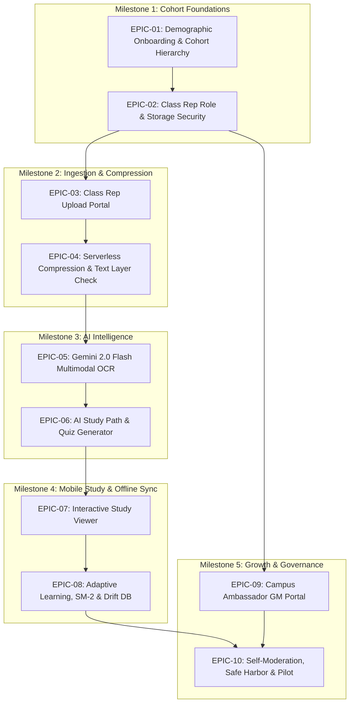

# Ace-Acad Agile Project Management Tracker
## AI Study Paths Revamp & Cohort-Based UGC ("Class Rep" Model)

**Project:** Ace-Acad Mobile (Flutter, Firebase, Gemini 2.0 Flash, Drift SQLite)  
**Parent Org:** WSTAR Enterprise Solutions (`wstar-website`)  
**Version:** 1.0.0  
**Last Updated:** August 20, 2026  
**Methodology:** Agile Scrum / Scrumban Hybrid (2-Week Sprints)  
**Target Pilot:** Ahmadu Bello University (ABU) 100L–200L Faculties of Engineering, Sciences, and Administration  
**Related OS Proposals:**
* `PROP-001`: *Cohort-Based UGC & The "Class Rep" Model*
* `PROP-002`: *AI Study & Study Paths Revamp (Tier 2 Hybrid AI)*
* `PROP-003`: *Cohort-Based UGC Upload & Automated Processing Architecture*

---

## 1. Operating Model & Agile Cadence

* **Sprint Duration:** 2 Weeks (10 Working Days)
* **Estimation Scale:** Modified Fibonacci $(1, 2, 3, 5, 8, 13)$
* **Target Velocity:** $32\text{ Story Points / Sprint}$
* **Team Roles:**
  * **Product Owner (PO):** Ibrahim Abdulwahab (Strategy, Scope, GTM Alignment)
  * **Scrum Master / Technical Lead:** Abdulaziz Abdulwahab (Sprint execution, technical unblocking)
  * **Mobile Engineers (Flutter/Dart):** Client UI, State Management, Local Drift DB
  * **Backend / Cloud Engineers (Node.js/Python/Firebase):** Cloud Functions, Storage Rules, AI API Integration
  * **QA / Test Automation:** Flutter Integration Tests, Emulator Regression, Security Auditing

---

## 2. Release Milestones Overview (M1 – M5)

| Milestone | Sprints | Focus Areas | Key Deliverables |
| :--- | :---: | :--- | :--- |
| **M1: Cohort Foundation** | **Sprints 1–2** | Demographic Routing & Role RBAC | University/Faculty/Dept/Level Onboarding, Firestore Cohort Registry, Storage Security Rules |
| **M2: Ingestion & Compression** | **Sprints 3–4** | Class Rep Portal & Serverless Ingestion | Multi-Format File Picker (`PDF/DOCX/PPTX`), Educational Warranties, Ghostscript/pdf-lib Cloud Compression, PyMuPDF Zero-Cost Text Layer Inspector |
| **M3: AI Intelligence** | **Sprints 5–6** | Gemini 2.0 Flash OCR & Study Path Synthesis | Multimodal OCR for Scanned/Handwritten Notes, Autonomous `StudyPath -> Module -> Topic` Tree Synthesis, Topic Quizzes & Past Exam Extraction |
| **M4: Mobile Learning & Offline** | **Sprints 7–8** | Interactive Study Viewer & Offline Sync | Page-Bound PDF Study Session UI, SuperMemo-2 (SM-2) Spaced Repetition Engine, Drift SQLite Offline Caching |
| **M5: Growth, Safe Harbor & Pilot** | **Sprints 9–10** | Ambassador Tools & Safe Harbor Launch | Campus Ambassador (Bridge Program) GM Portal, Viral WhatsApp Cohort Invites, In-App Reporting & 3-Flag Auto-Quarantine, ABU Pilot Deployment |

---

## 3. Epics Breakdown & Story Point Budget

```
EPIC BUDGET BREAKDOWN (260 Total Story Points)
═══════════════════════════════════════════════════════════════════════════════
[EPIC-01] Demographic Onboarding & Cohort Data Model           (21 pts) - Sprint 1
[EPIC-02] Class Rep Role, Verification & Security Rules        (18 pts) - Sprint 2
[EPIC-03] Class Rep Upload Portal & Staging System             (24 pts) - Sprint 3
[EPIC-04] Serverless Compression & Text Layer Engine           (26 pts) - Sprint 4
[EPIC-05] Gemini 2.0 Flash Multimodal OCR Pipeline             (29 pts) - Sprint 5
[EPIC-06] Autonomous AI Study Path & Quiz Generator            (34 pts) - Sprint 6
[EPIC-07] Interactive Study Session & Mobile Document Viewer   (26 pts) - Sprint 7
[EPIC-08] Adaptive Learning Engine & Offline Drift DB          (31 pts) - Sprint 8
[EPIC-09] Campus Ambassador (Bridge Program) GM System         (23 pts) - Sprint 9
[EPIC-10] Self-Moderation, Safe Harbor & ABU Pilot Launch      (28 pts) - Sprint 10
═══════════════════════════════════════════════════════════════════════════════
```

---

## 4. Sprint-by-Sprint Execution Backlog

### Sprint 1: Demographic Onboarding & Cohort Hierarchy
* **`US-1.1`** (8 pts, P0) — Multi-Tier University/Faculty/Department Selector
* **`US-1.2`** (5 pts, P0) — Academic Level Selection & Cohort Key Derivation
* **`US-1.3`** (5 pts, P0) — Firestore Cohort Registry & Auto-Provisioning
* **`US-1.4`** (3 pts, P1) — User Profile Model Migration & Backward Compatibility

### Sprint 2: Cohort Workspace UI & Class Rep Authorization
* **`US-2.1`** (8 pts, P0) — Cohort Shared Workspace ("Class Hub") Screen
* **`US-2.2`** (5 pts, P0) — Role-Based Access Control (`UserRole` Enum & Claims)
* **`US-2.3`** (3 pts, P1) — Class Rep Verified Badge & Rep Identity Header
* **`US-2.4`** (5 pts, P0) — Firebase Storage Rules for Cohort Scoping

### Sprint 3: Class Rep Upload Portal & Cloud Staging Pipeline
* **`US-3.1`** (5 pts, P0) — Multi-Format File Picker Integration (`file_picker`)
* **`US-3.2`** (5 pts, P0) — Class Rep Upload Metadata & Legal Warranty Form
* **`US-3.3`** (8 pts, P0) — Resumable Upload Engine with Progress Indicator
* **`US-3.4`** (6 pts, P0) — Staging Firestore Ingestion Record (`cohort_uploads`)

### Sprint 4: Serverless Compression & Text Layer Engine
* **`US-4.1`** (5 pts, P0) — Cloud Function Storage Trigger (`processCohortUpload`)
* **`US-4.2`** (8 pts, P0) — Containerized Ghostscript Compression Microservice
* **`US-4.3`** (5 pts, P1) — `pdf-lib` Metadata & Object Tree Stripper
* **`US-4.4`** (8 pts, P0) — Zero-Cost Text Layer Inspector with PyMuPDF

### Sprint 5: Gemini 2.0 Flash Multimodal OCR Pipeline
* **`US-5.1`** (8 pts, P0) — Gemini 2.0 Flash Multimodal PDF Ingestion Client
* **`US-5.2`** (8 pts, P0) — Structural Markdown OCR Prompt Engineering
* **`US-5.3`** (8 pts, P1) — Math, Formula & Diagram Layout Preservation
* **`US-5.4`** (5 pts, P0) — OCR Chunking & Cost Optimization Engine

### Sprint 6: Autonomous AI Study Path & Quiz Generation
* **`US-6.1`** (13 pts, P0) — Gemini Curriculum & Study Path Synthesizer
* **`US-6.2`** (8 pts, P0) — Automated Topic Quiz Generator (5–10 MCQs)
* **`US-6.3`** (8 pts, P1) — Past Question Extractor & Exam Drill Formatter
* **`US-6.4`** (5 pts, P1) — Cohort Real-Time Push Notification Dispatcher

### Sprint 7: Interactive Study Session & Mobile Document Viewer
* **`US-7.1`** (8 pts, P0) — Page-Bound PDF Study Viewer (`flutter_pdfview`)
* **`US-7.2`** (8 pts, P0) — Topic Checkpoint Navigation & Reading Progress
* **`US-7.3`** (5 pts, P0) — Embedded Topic Quiz Overlay & Instant Feedback
* **`US-7.4`** (5 pts, P0) — In-Viewer Safe Harbor "Report Document" Modal

### Sprint 8: Adaptive Learning, Spaced Repetition (SM-2) & Drift SQLite Sync
* **`US-8.1`** (8 pts, P0) — Drift SQLite Cohort Tables & Schema Migration
* **`US-8.2`** (8 pts, P0) — Offline-First Study Path & Material Caching
* **`US-8.3`** (8 pts, P1) — SM-2 Spaced Repetition Review Scheduler
* **`US-8.4`** (7 pts, P1) — Student Topic Proficiency Model (`UserProficiency`)

### Sprint 9: Campus Ambassador (Bridge Program) GM Portal
* **`US-9.1`** (8 pts, P0) — Campus Ambassador Mobile Dashboard
* **`US-9.2`** (8 pts, P0) — Class Rep Invite & Verification Workflow
* **`US-9.3`** (5 pts, P1) — Departmental Activation Tracker & Analytics
* **`US-9.4`** (2 pts, P0) — Viral Cohort WhatsApp Invite Generator (`share_plus`)

### Sprint 10: Self-Moderation, DMCA Safe Harbor, Pilot Launch & Monitoring
* **`US-10.1`** (5 pts, P0) — In-App Content Rating & Flagging Mechanism
* **`US-10.2`** (8 pts, P0) — Automated 3-Flag Quarantine Cloud Function
* **`US-10.3`** (5 pts, P0) — Super Admin DMCA & Escalation Dashboard
* **`US-10.4`** (10 pts, P0) — ABU Pilot Deployment & Production Smoke Testing

---

## 5. Cross-Epic Dependency Graph



---

## 6. RAID Log (Risks, Assumptions, Issues, Dependencies)

| Risk ID | Description | Impact | Prob. | Severity | Mitigation Strategy | Owner |
| :---: | :--- | :---: | :---: | :---: | :--- | :--- |
| **R-01** | **Ghostscript Binary Timeout on Heavy Scans** | High | Med | **HIGH** | Set Cloud Function timeout to 540s, allocate 2GB RAM, and stream progress. | Abdulaziz |
| **R-02** | **Gemini 2.0 Flash Rate Limits during Peak Uploads** | Med | Med | **MED** | Implement exponential backoff queue with Google Cloud Tasks. | Abdulaziz |
| **R-03** | **Copyright Infringement Allegations on Textbooks** | High | Low | **HIGH** | Strict Safe Harbor terms, uploader educational warranty, and automated 3-flag quarantine. | Ibrahim |
| **R-04** | **Class Rep Inactivity / Churn** | High | Med | **HIGH** | Campus Ambassadors monitor upload activity; enable multi-rep co-authorization per department. | Ibrahim |
| **R-05** | **Offline Drift SQLite Migration Conflicts** | Med | Low | **LOW** | Use Drift schema versioning with deterministic migration test suites. | Abdulaziz |
