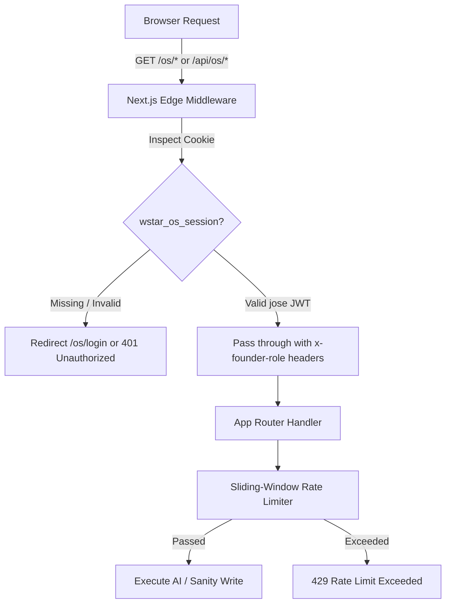

# WSTAR Technical Architecture & System Design

This document details the architectural foundation, security layer, state management, Gemini AI engine, and real-time synchronization of the **WSTAR Enterprise Web Platform & Company Operating System**.

---

## 1. Dual-Shell Application Architecture

The repository serves two distinct functional domains from a unified Next.js App Router codebase:

```
wstar-website/
├── src/app/
│   ├── (Marketing Shell)      # Public Corporate & Product Pages
│   │   ├── page.tsx           # WSTAR Enterprise Solutions & Leadership
│   │   ├── about/             # Company Mission & African Innovation
│   │   ├── ai-solutions/      # WSTAR AI Solutions (Industrial & B2B Agentic AI)
│   │   ├── investors/         # Investment Deck & Market Sizing
│   │   ├── contact/           # Business Enquiries & Partnerships
│   │   └── products/          # Product Showcase & NDPA Legal Center
│   │       ├── ace-acad/      # Ace Acad Product Page & Legal Policies
│   │       └── plantiq/       # PlantIQ AgriTech Diagnostics
│   │
│   ├── os/                    # Internal Company Operating System
│   │   ├── login/             # Founder JWT Authentication Portal
│   │   ├── page.tsx           # Executive Dual-Perspective Dashboard + AI Briefing
│   │   ├── sources/           # Source Intelligence & Google Drive Knowledge Hub
│   │   ├── work/              # Unified Work Stream, Kanban & Subtask Tracker
│   │   ├── proposals/         # Strategic Proposals Hub & AI Task Extraction
│   │   ├── ace-acad/          # Ace Acad Product Command Center
│   │   ├── decisions/         # Architectural Decision Records (ADR) Ledger
│   │   ├── feedback/          # Student Qualitative Feedback Triage & Converter
│   │   ├── roadmap/           # Multi-Horizon Strategy Planner & Milestones
│   │   └── activity/          # Audit Trail, Actor Filter & CSV Governance Export
│   │
│   └── api/os/                # Secure Server-Side Gateways & AI Services
│       ├── auth/              # JWT session creation, validation & logout
│       ├── sources/           # Google Drive link detection & metadata parsing
│       ├── ai/                # Gemini Flash NLP Classification & Task Extraction
│       │   ├── classify/      # Real-time debounced entity & assignee extraction
│       │   ├── decompose/     # Engineering subtask checklist generator
│       │   ├── digest/        # Executive daily async handoff briefing
│       │   └── extract-proposal-tasks/ # Multi-doc sprint backlog parser
│       ├── sync/              # Zod-validated mutation handler (create/patch/delete)
│       ├── seed/              # Batch database seeder with confirmation guard
│       └── fetch/             # GROQ data retrieval endpoint
```

---

## 2. Security Architecture & Edge Authentication

WSTAR OS implements enterprise-grade zero-trust access control at the edge:



### Key Security Implementations:
1. **Edge JWT Protection (`src/middleware.ts`)**: Intercepts all requests targeting `/os/*` and `/api/os/*` before rendering, verifying signed `jose` JWT tokens.
2. **Server-Side Token Isolation**: `SANITY_API_WRITE_TOKEN` and `GEMINI_API_KEY` are strictly server-side environment variables without `NEXT_PUBLIC_` prefixes.
3. **Zod Runtime Validation (`src/os/lib/validation.ts`)**: All mutations dispatched to `/api/os/sync` are validated against strict TypeScript schemas.
4. **Sliding-Window Rate Limiting (`src/os/lib/rateLimit.ts`)**: API and AI endpoints are guarded by per-IP rate limits to prevent token exhaustion and brute-force attacks.

### Second Gate: The Newsroom Studio

The password-gated publishing studio at `/publications/admin` is a **second,
independent auth surface**, and understanding why it is not simply part of the OS
matters before touching it:

- **Separate session by design.** The OS session grants roadmap, proposals, decisions, sources, and financial context. Posting a press release should not require that blast radius, so the studio issues its own cookie — `wstar_pub_session`, 12h, `SameSite=Strict`, signed with the same `AUTH_SECRET` but carrying `scope: "publications"`, which `verifyPublicationsToken()` rejects if absent. The two sessions do not grant each other anything.
- **Password-only, both founders.** The gate takes no email. `identifyByPassword()` in `src/lib/publicationsAuth.ts` compares the submitted value in constant time against every configured founder password and resolves whichever matched, so `FOUNDER_PASSWORD_ABDULAZIZ` and `FOUNDER_PASSWORD_IBRAHIM` both work and the header still shows the right name.
- **No middleware backstop.** `src/middleware.ts` matches `/os/:path*` and `/api/os/:path*` only. `/publications/admin` is deliberately outside it — it must render its own lock screen, not redirect to `/os/login`. The consequence: **every** `/api/publications/*` handler must call `requirePublicationsSession(req)` itself. A new route that forgets is public.
- **Unlisted, not secret.** `noindex, nofollow` on the page, absent from `sitemap.ts`, disallowed in `robots.ts`. Obscurity is a convenience, never the control — the password is.

See [Newsroom Studio Guide](NEWSROOM_STUDIO.md) for the full surface.

---

## 3. Modern Reactive State Layer (Zustand)

State is organized into fine-grained modular Zustand domain stores located in `src/os/store/`:

| Store | Responsibility | Features |
|---|---|---|
| **`useWorkStore`** | Work items, bugs, tasks | Optimistic updates, auto-rollback on failure, subtasks, monotonic IDs (`TASK-xxx`, `BUG-xxx`) |
| **`useProposalStore`** | Strategic proposals | Roadmap phase promotion, sprint task extraction, status workflows |
| **`useDecisionStore`** | Architectural Decision Records | Monotonic numbering (`DEC-xxx`), co-signers, alternatives considered |
| **`useFeedbackStore`** | Customer feedback triage | 1-click conversion to tracked engineering work items |
| **`useRoadmapStore`** | Milestones & multi-horizon items | Progress calculation, project status management |
| **`useActivityStore`** | Live audit log | Full activity history with actor and target filtering |
| **`useMetaStore`** | Products, areas, sync status | Role management (Abdulaziz vs Ibrahim), cloud sync indicators |
| **`useToastStore`** | User feedback notifications | Ephemeral toast messages for mutations, rollbacks, and AI completions |

### Optimistic Updates with Rollback
Every mutation immediately updates the local UI for sub-millisecond perceived latency, then calls `dispatchMutation()` in the background. If the cloud write fails, the store automatically reverts to its pre-mutation snapshot and surfaces a non-blocking toast alert.

---

## 4. Real AI Intelligence Engine (Gemini Flash & Lite)

WSTAR OS integrates Google Gemini Generative Language APIs with cost-optimized routing:

```mermaid
graph LR
    subgraph UI
        Capture[Quick Capture Modal]
        Decomp[Decomposition Modal]
        Handoff[Founder Handoff Card]
        ProposalModal[Proposal Detail Modal]
    end

    subgraph API Routes
        ClassifyRoute[/api/os/ai/classify]
        DecompRoute[/api/os/ai/decompose]
        DigestRoute[/api/os/ai/digest]
        ExtractRoute[/api/os/ai/extract-proposal-tasks]
    end

    subgraph Gemini Models
        FlashLite[gemini-3.5-flash-lite <br> $0.30/1M tokens]
        FlashLatest[gemini-flash-latest <br> $1.50/1M tokens]
    end

    Capture -->|400ms Debounce| ClassifyRoute --> FlashLite
    Decomp --> DecompRoute --> FlashLite
    Handoff --> DigestRoute --> FlashLatest
    ProposalModal --> ExtractRoute --> FlashLatest
```

### Cost & Latency Benchmark:
- **`gemini-3.5-flash-lite`** ($0.30 / $2.50 per 1M tokens): Ultra-fast ~200ms latency for debounced quick-capture typing analysis and subtask generation.
- **`gemini-flash-latest`** ($1.50 / $7.50 per 1M tokens): Higher reasoning capacity for multi-document strategic proposal decomposition and founder daily handoff briefings.

---

## 5. Granular Sanity Real-Time Subscriptions

Instead of full-database refetches on listener events, `src/os/sanity/realtime.ts` listens to granular `appear`, `update`, and `disappear` mutations from Sanity and patches specific Zustand store slices directly:

```typescript
const subscription = client.listen(groq`*[_type in ["workItem", "decision", "proposal", "feedbackItem"]]`).subscribe((update) => {
  if (update.result) {
    applyRemoteDoc(update.result)
  } else if (update.documentId) {
    applyRemoteDelete(update.documentId)
  }
})
```

---

## 6. Living Documentation & Operational Memory

1. **`MISTAKES.md`**: Preserves continuous troubleshooting history and operational lessons learned.
2. **`AUDIT_MASTER_IMPLEMENTATION_TRACKER.md`**: Master tracking document mapping all 22 independent audit findings across the 5 implementation phases.
3. **`docs/ARCHITECTURE.md`**: Authoritative system architecture reference.
