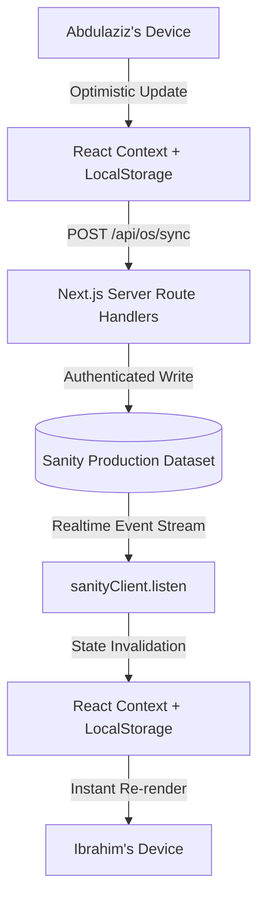

# WSTAR Technical Architecture & System Design

This document details the architectural foundation, data flow, state management, and real-time synchronization of the **WSTAR Web Platform & Company Operating System**.

---

## 1. Dual-Shell Architecture

The repository serves two distinct functional domains from a unified Next.js App Router codebase:

```
wstar-website/
├── src/app/
│   ├── (Marketing Shell)      # Public Corporate & Product Pages
│   │   ├── page.tsx           # WSTAR Enterprise Solutions & Leadership
│   │   ├── about/             # Company Mission & African Innovation
│   │   ├── investors/         # Investment Deck & Market Sizing
│   │   ├── contact/           # Business Enquiries & Partnerships
│   │   └── products/          # Product Showcase & NDPA Legal Center
│   │       ├── ace-acad/      # Ace Acad Product Page & Legal Policies
│   │       └── plantiq/       # PlantIQ AgriTech Diagnostics
│   │
│   ├── os/                    # Internal Company Operating System
│   │   ├── page.tsx           # Dual-Perspective Founder Dashboard
│   │   ├── work/              # Unified Work Stream & Kanban Board
│   │   ├── proposals/         # Strategic Proposals Hub & Task Promotion
│   │   ├── ace-acad/          # Ace Acad Product Command Center
│   │   ├── decisions/         # Architectural Decision Records (ADRs)
│   │   ├── feedback/          # Student Qualitative Feedback Triage
│   │   ├── roadmap/           # Multi-Horizon Strategy Planner
│   │   └── activity/          # System Audit Trail & Real-time Stream
│   │
│   └── api/os/                # Secure Server-Side Sanity Gateways
│       ├── sync/              # Mutation handler (create, patch, delete)
│       ├── seed/              # Batch database seeder
│       └── fetch/             # GROQ data retrieval endpoint
```

### Layout Isolation
The marketing `Navbar` and `Footer` are isolated via `src/components/MarketingShell.tsx`. Routes under `/os` render inside a dedicated full-viewport application layout with an interactive sidebar, breadcrumbs, role toggle, and command palette.

---

## 2. Data Flow & Sanity Cloud Synchronization

WSTAR OS implements a **hybrid resilient sync engine** providing instant local responsiveness, offline capability, and cross-device live updates between co-founders:



### Key Security & Architecture Properties:
1. **Server-Side Token Security**: `SANITY_API_WRITE_TOKEN` is never prefixed with `NEXT_PUBLIC_` and remains strictly on the Node.js server. Client browsers communicate exclusively via internal `/api/os/*` routes.
2. **Realtime Event Stream**: When either founder modifies a task, decision, or proposal status, `sanityClient.listen()` catches the mutation event and triggers `refreshFromSanity()`, updating all open browser windows without page refresh.
3. **Local Optimistic Cache**: State is updated immediately in React Context and mirrored to `localStorage`. If internet connectivity drops, the OS continues operating seamlessly.

---

## 3. Design System & Anti-AI Editorial Aesthetics

The application adheres to strict editorial design principles:
- **Typography Hierarchy**: **Montserrat** for structured headings and brand marks; **Inter** for readable UI body copy and tabular metrics.
- **Design Restraint**: Zero generic purple-on-dark gradients, zero biscuit pill headlines, zero arbitrary emojis, and zero 3-card bento grids.
- **Micro-Interactions**: Tactile `active:scale-[0.98]` active press states, subtle borders (`border-slate-200 dark:border-slate-800`), and accessible focus rings.
